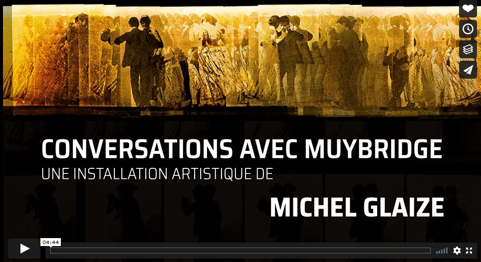

# Conversation avec Muybridge
Voici l'ensemble du code / modèles 3D réalisés pour l'installation Conversation avec Muybridge de Michel Glaize au carrée d'art de nîmes

# Présentation

Vous pouvez voir la présentation de l'installation sur le site de Michel Glaize : https://www.michelglaize.com/teaser/

